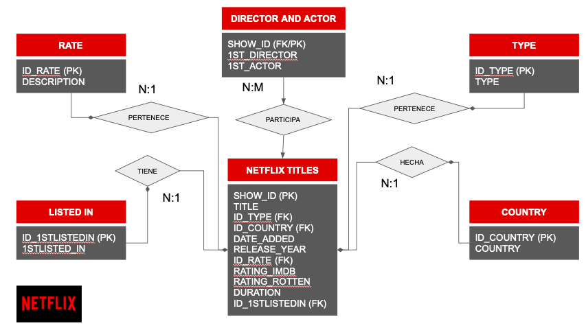
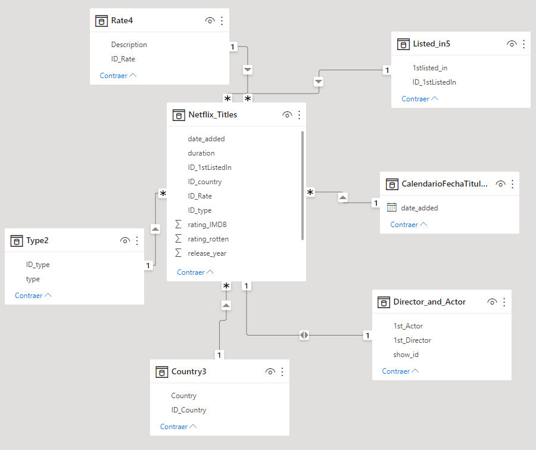
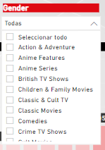
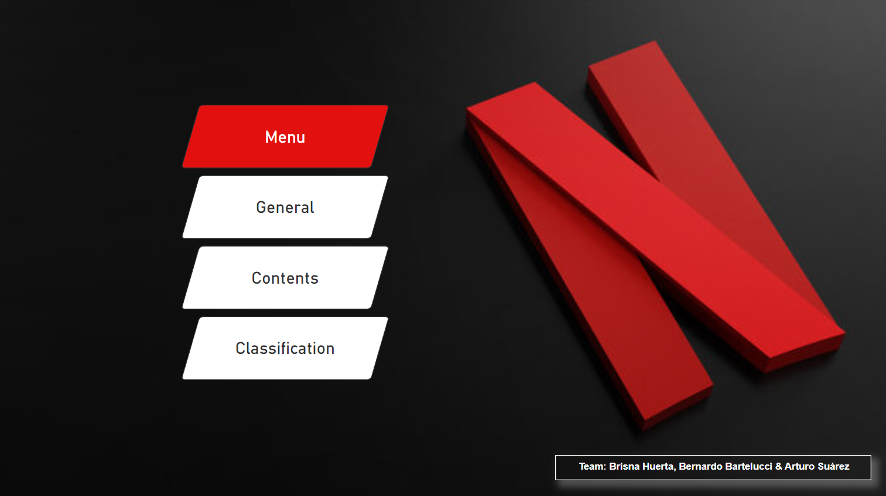
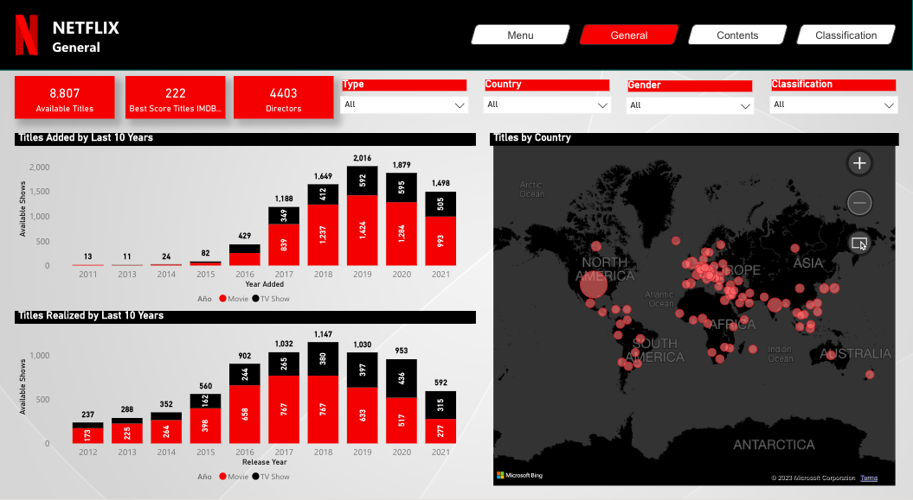
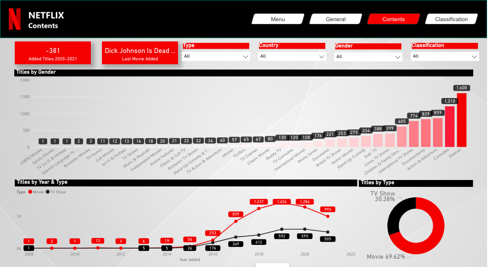
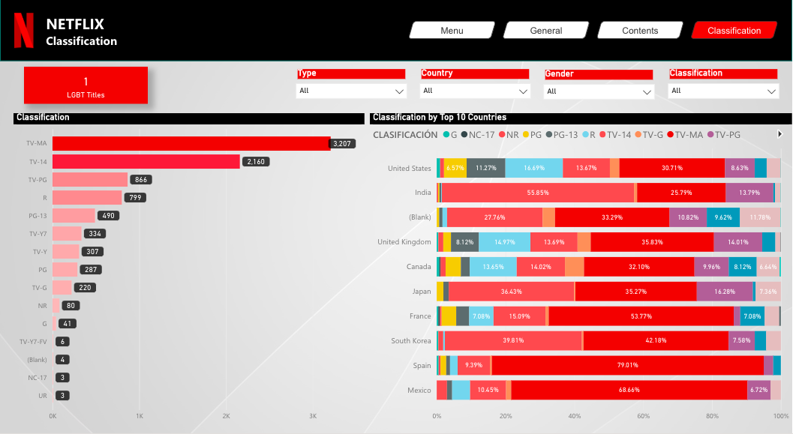

### Evaluación de títulos de Netflix 2022

## Contexto

NETFLIX es mundialmente conocido como el pionero de la televisión por internet, también conocido este servicio como streaming video.
Hasta hace unos años, lideraba el mercado por lo cuál su catálogo fue enriquecido con una gran cantidad de títulos e incluso, empezó a generar sus propios formatos.
Sin embargo, con la llegada de la terrible pandemia de 2019, muchas otras empresas comenzaron a buscar posibilidades de negocios y, sobre todo, apostaron por innovar sus servicios, siendo el internet el mejor medio para no morir en el intento.
Es por ello que la plataforma de Netflix comenzó a buscar nuevos títulos con temas diversos, convenios de exclusividad, etc.; con la finalidad de atraer y mantener la cantidad de suscriptores.
En los últimos años, el panorama no ha sido nada fácil para la compañía. Es por ello, que surgió la idea de tomar información de su catálogo completo (desde sus inicios hasta finales de 2021) para así, junto con la información de las calificaciones de IMBD y Rotten Tomatoes, poder observar la situación actual de la empresa en cuanto a contenido y su aceptación entre los consumidores.

## Descripción de la temática de los datos

Para el presente proyecto, se extrajo información del catálogo de la plataforma de streaming “Netflix” y la recepción de la sociedad al mismo.
Se obtuvieron varios datos sobre los títulos de la plataforma. Por ejemplo:

* Director
* Actor
* Fecha del título
* Fecha en la que fue añadida al servicio

A su vez, mediante otro dataset se adquirieron datos sobre las puntuaciones de los títulos en el catálogo. Se tuvieron en cuenta dos de las páginas más populares: **IMDB** y **Rotten Tomatoes**.

## Objetivos

Este proyecto tiene como finalidad:

1. Analizar la influencia cultural de distintos países en el catálogo como podrían ser EEUU e India, los cuales poseen una gran parte del directorio y, con ello, la predominancia de títulos pertenecientes a un idioma o continente.
2. Estudiar las películas más exitosas y populares de la plataforma con base en las puntuaciones de la crítica.
3. Analizar actores y directores que participaron en éstas y determinar si hay alguna relación en la influencia cultural.

## Dataset

El dataset que se utilizó para el estudio de sus datos se muestra a continuación:

[Dataset_NETFLIX](https://github.com/brisnahuerta/coderhouse/tree/main/Data%20Analyst/Netflix/dataset)

Dicha recopilación de datos tiene en su mayor parte información cualitativa correspondiente al tipo de títulos vigentes en la plataforma NETFLIX hasta diciembre de 2021. Aunado a esto, cuenta con dos calificaciones de cada uno de los títulos hechas a través de los portales IMDB Y Rotten Tomatoes, los cuales tienen como puntuación máxima 5 y mínima 0.

Este dataset está compuesto por seis tablas, las cuales se muestran a continuación:

* NETFLIX TITLES
* DIRECTOR AND ACTOR
* TYPE
* COUNTRY
* RATE
* LISTED_IN

## Usuario final y nivel de aplicación de análisis

El análisis de los datos, así como su visualización, está diseñado para niveles tácticos. Es decir, la información que se presenta es ideal para la toma de decisiones de los líderes del área encargada de la actualización del catálogo de manera anual.

Dicha información está estrechamente relacionada con el contenido del catálogo disponible en la plataforma, el tipo de título, su categoría y clasificación. También contiene el nivel de aceptación de los usuarios mediante dos evaluaciones.

## Diagrama entidad - relación

Se elaboró un diagrama DER, el cuál se presenta a continuación:

## Definición de claves por tabla

En este apartado, se hará mención de cada una de las tablas junto a una breve descripción de las mismas y la definición de la clave primaria y foránea:

1. NETFLIX TITLES

| Tipo de Clave | Campo          | Tipo de Campo |
| :-------------- | ---------------- | --------------- |
| PK            | show_id        | varchar (5)   |
|           | title          | varchar (255) |
| FK            | id_type        | varchar (3)   |
| FK            | id_country     | varchar (3)   |
|           | date_added     | date          |
|           | release_year   | int           |
| FK            | id_rate        | varchar (255) |
|           | rating_IMDB    | decimal       |
|           | rating_rotten  | decimal       |
|           | duration       | varchar (255) |
| FK            | id_1stListedin | varchar (5)   |

2. DIRECTOR AND ACTOR

| Tipo de Clave | Campo   | Tipo de Campo |
| --------------- | --------- | --------------- |
| PK            | id_type | varchar (3)   |
|           | type    | varchar (255) |

3. TYPE

| Tipo de Clave | Campo        | Tipo de Campo |
| --------------- | -------------- | --------------- |
| PK/FK         | show_id      | varchar (5)   |
|           | 1st_director | varchar (255) |
|           | 1st_actor    | varchar (255) |

4. COUNTRY

| Tipo de Clave | Campo      | Tipo de Campo |
| --------------- | ------------ | --------------- |
| PK            | id_country | varchar (3)   |
|           | country    | varchar (255) |

5. RATE

| Tipo de Clave | Campo       | Tipo de Campo |
| --------------- | ------------- | --------------- |
| PK            | id_rate     | varchar (10)  |
|           | description | varchar (255) |

6. LISTED_IN

| Tipo de Clave | Campo          | Tipo de Campo |
| --------------- | ---------------- | --------------- |
| PK            | id_1stListedin | varchar (5)   |
|           | 1stlisted_in   | varchar (255) |

## Transformación de datos

Se duplicó la tabla de Títulos, para luego eliminar todas las columnas a excepción de “date_added” la cual tiene información acerca de cuándo fueron añadidos los títulos a la plataforma de Netflix.

Posteriormente se quitaron los duplicados de la columna; además fue necesario ordenar la columna de manera ascendente y remover la primera fila superior ya que tenía un dato “null”.

## Modelo relacional

## Medidas calculadas

Se realizaron una serie de medidas, en su mayoría relacionadas con las columnas Rating_IMDB Y Rating_Rotten. Los hallazgos fueron los siguientes:

* *Medida con una variable y una función de agregación*

Busca el promedio del rating Rotten en el año 2021 y obtiene la diferencia de dicho rating con respecto al año pasado. El resultado final es de 0.03

AVG ROTTEN 2021 VS 2020 =
VAR AVG2021 =
CALCULATE(AVERAGE(Show1[rating_rotten]),Show1[release_year]=2021)
RETURN AVG2021 -
CALCULATE(AVERAGE(Show1[rating_rotten]),Show1[release_year]=2020)

* *Medida con una variable y una función de conteo*

Busca el promedio mensual de los títulos realizados durante el 2020. El resultado que se obtiene es de 79 títulos por mes durante dicho año.

AVG TítulosRealizadosPorMes2020 = VARTitulosRealizados2020=CALCULATE(COUNT(Show1[show_id]),FILTER(ALL(Show1[release_year]),Show1[release_year]=2020))
RETURN TitulosRealizados2020/12

* *Medida con dos variables (una función de agregación y una función de inteligencia de tiempo)*

Esta medida es otra opción para buscar la diferencia del promedio mensual de los títulos realizados durante el periodo 2020 - 2021 (tal como se calculó en el primer ejemplo) pero esta vez utilizando dos variables y una función de inteligencia de tiempo. La diferencia obtenida es de 0.03

AVG2 ROTTEN 2021 VS 2020 =
VAR AVG2021 =
CALCULATE(AVERAGE(Show1[rating_rotten]),Show1[release_year]=2021)
VARAVG2020=CALCULATE(AVERAGE(Show1[rating_rotten]),DATEADD('Calendar'[date_added],-1,YEAR))
RETURN AVG2021-AVG2020

* *Medida con un parámetro(con una función de agregación)*

En este caso, se está buscando una proyección para el 2022. Con un porcentaje que va del 1 al 100. En esta medida se muestra el promedio de ambos ratings (IMBD y Rotten) de todos los títulos del catálogo. El resultado obtenido es 2.85.

AVG RATING IMDB & ROTTEN =
VAR AVGIMDB = AVERAGEA(Show1[rating_IMDB])
VAR AVGROTTEN = AVERAGEA(Show1[rating_rotten])
VAR AVGRATING = (AVGIMDB + AVGROTTEN)/2
RETURN AVGRATING

Si utilizamos un parámetro con esta medida podríamos observar cómo aumentaría la calificación el próximo año con base en un porcentaje, por ejemplo:

10% = El resultado obtenido es 3.13
25% = El resultado obtenido es 3.56
50% = El resultado obtenido es 4.27

## Segmentaciones elegidas

Para este proyecto se hizo uso de los siguientes recursos:

Listas desplegables

* Type: Filtra la información por tipo de título (TV shows/TV movies)
* Country: Muestra un listado de los países que conforman el catálogo de la plataforma
* Gender: Se puede seleccionar el género para filtrar información específica.
* Classification: Muestra las diferentes clasificaciones que se le dan a los títulos.

Este es un ejemplo de una lista desplegable:

## Análisis funcional del tablero

El diseño del tablero fue realizado pensando en que la información brindada será de utilidad y uso para lideres del área a nivel táctico. Este dashboard está compuesto de 4 solapas, las cuales se describen a continuación:

1. **MENU**
   Esta solapa tiene como objetivo mostrar de manera general el contenido del dashboard. Los botones son útiles si se desea ir a alguna de las solapas sin orden; es decir, se puede ir directamente a la solapa “Clasificación” dando click en el botón con el mismo nombre.

   
2. **GENERAL**
   Esta solapa contiene gráficos con información general. Está distribuido de la siguiente manera:

* En la parte superior Izquierda, se puede observar un KPI con el total de títulos disponibles en la plataforma.
* Siguiendo por la derecha, se encuentra un KPI que muestra el total de títulos con la máxima calificación tanto en Rotten Tomatoes como en IMDB.
* A la derecha, se encuentra un KPI con el conteo total de directores que participaron en los títulos del catálogo de NETFLIX.
* Posteriormente, a la derecha se observan cuatro filtros. Uno de ellos sirve para poder obtener datos por Tipo de Título (ya sea TV movies o TV shows).
* El siguiente es útil para conocer información del tablero de acuerdo con el país seleccionado. Además, hay otra segmentación por género del título y finalmente un por clasificación o rating.
* En la parte izquierda del informe se pueden observar dos gráficos de columnas. En el superior se muestra la cantidad de títulos añadidos en el respectivo año.
* En el gráfico inferior izquierdo se muestra en qué año fueron producidos los títulos del catálogo/plataforma de Netflix.
* Finalmente, en el sector derecho del informe se encuentra un mapa interactivo con un lazo para seleccionar regiones del mundo y cantidad de títulos producidos en la misma.

  

3. **CONTENTS**
   Esta solapa contiene información relevante del contenido del catálogo de NETFLIX. Dicha información está dividida en 3 gráficos ordenados de la siguiente manera:

* En la parte superior se puede observar un gráfico de barras que muestra la cantidad de títulos por géneros en la plataforma.
* Debajo del gráfico de barras por género se encuentra un gráfico de líneas que muestra el crecimiento del catálogo de Netflix a través de los años tanto para películas como para series.
* El ultimo grafico de esta solapa se encuentra en el extremo inferior derecho, el mismo es un gráfico circular que muestra el porcentaje de películas y TV shows presente en el servicio de streaming.
* Al igual que en la solapa general esta tiene los mismos 4 filtros.
* En el caso de las tarjetas, en esta página se encuentran dos, uno muestra el último título añadido a Netflix y el otro muestra la diferencia de obras audiovisuales añadidas en el 2021 respecto del 2020, en esta se observa que se añadieron 381 títulos menos en 2021 que en 2020.

  

4. **CLASSIFICATION**
   La tercera solapa tiene como nombre “CLASSIFICATION”. Inicialmente se había diseñado con el nombre de “PAÍS” pero se llegó a la conclusión de que, debido a su contenido, era más certero cambiarle el nombre.
   La información de esta solapa se divide en:

* En el extremo superior derecho se encuentran los mismos 4 filtros que presentaban las solapas anteriores.
* En el otro extremo encontramos una tarjeta que muestra la cantidad de títulos LGBT en el catálogo.
* En la parte inferior derecha se puede ver un gráfico de barras 100% apiladas con el país y la cantidad de títulos que tiene por clasificación. Si te sitúas en alguno de los colores de cada barra también se podrá observar cómo se despliega un cuadro informativo que te dirá la descripción de dicha clasificación.
* Para concluir, el gráfico de la izquierda es un gráfico de barras lateral el cual indica la cantidad de títulos disponibles por clasificación.

  

## Herramientas tecnológicas utilizadas

Para el ejercicio de este proyecto, se hizo uso de SQL como herramienta de consulta y limpieza así como Power BI como herramienta de visualización.

## Conclusión

Este dashboard deja ver a simple vista una tendencia de declive por parte de Netflix desde 2019, esta situación se puede atribuir principalmente a la pandemia mundial que provoco el Covid-19, la cual afectó al sector de entretenimiento limitando la generación de nuevo contenido no solo para Netflix si no para todos los generadores de contenido.

Adicional a esta situación, otras empresas han decidido generar su propia plataforma de streaming lo cual sin duda genera una mayor repartición de mercado considerando que cada una de ellas tiene a su favor contenido original creado durante años y con presupuesto para generar nuevo contenido, dando a Netflix la posibilidad de utilizar su catálogo solo a través de licenciamientos o bien negociaciones por exclusividad de franquicias ya posicionadas, siendo las películas el principal formato que ofrece Netflix en su catálogo.

Actualmente el contenido que muestra Netflix es muy variado (abarcando géneros desde dramas, comedias, acción y aventura como documentales, familiares e infantil, así como otros géneros más especializados como lo son animes, sci-fi, stand up, etc.) que en los últimos años ha tenido un auge cultural importante. Sin duda, esto es una gran ventaja que debe explotar ya que al ser pionera en streaming cuenta con información más precisa en cuanto a la segmentación de públicos y sus gustos.

Otro tema importante que debe considerarse en este dashboard es el uso de las clasificaciones. Mientras que en países como México o España se tiene mayor apertura y libertad de publicación de diferencias clasificaciones, países como Japón o Corea del Sur muestran poca permisibilidad a mostrar contenido considerado para un público adulto.

En conclusión, Netflix debe reposicionar su plataforma a través de un análisis más crítico a su portafolio, invertir en generar mayor contenido original que le permita competir y tener las exclusividades como lo hacen su similares y continuar ofreciendo un catálogo amplio como lo ha venido realizando en los últimos años.
